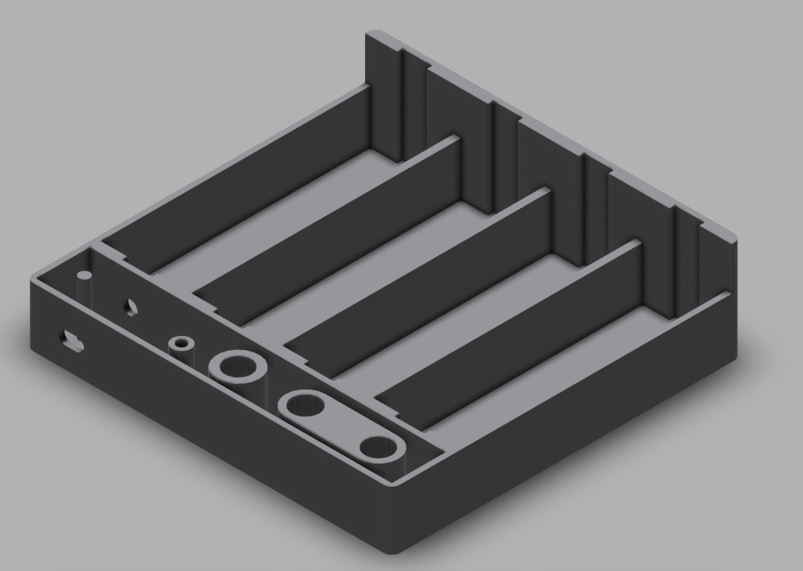
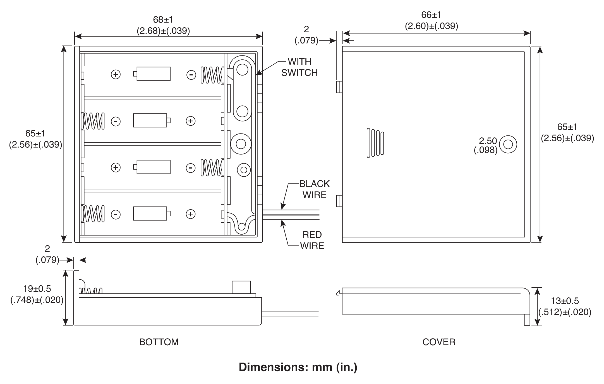
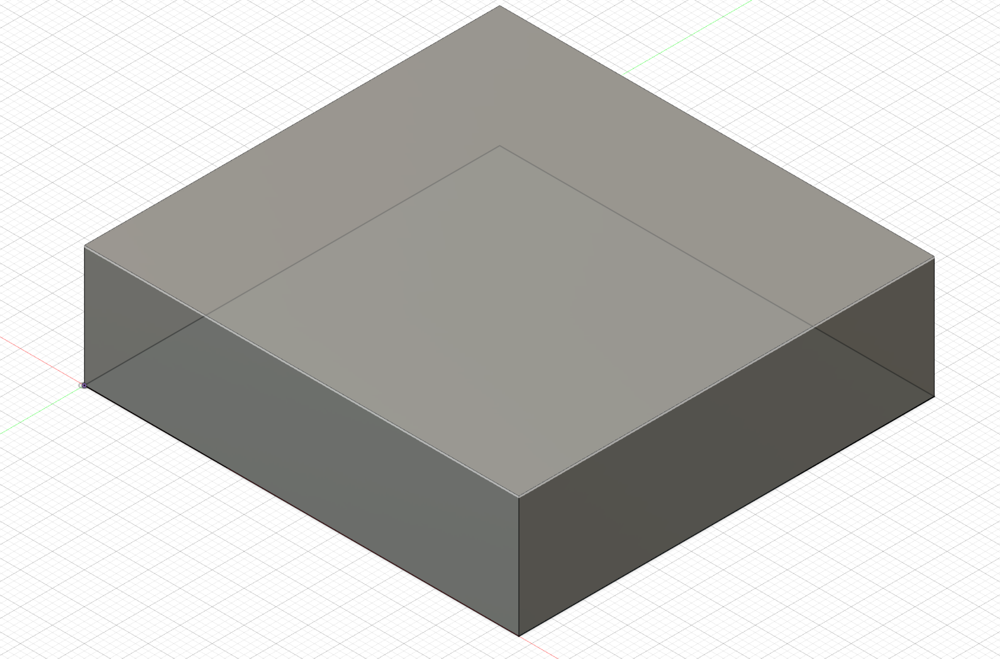
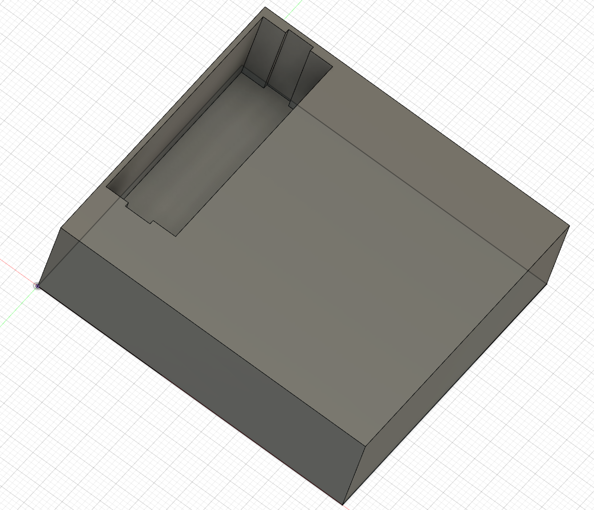
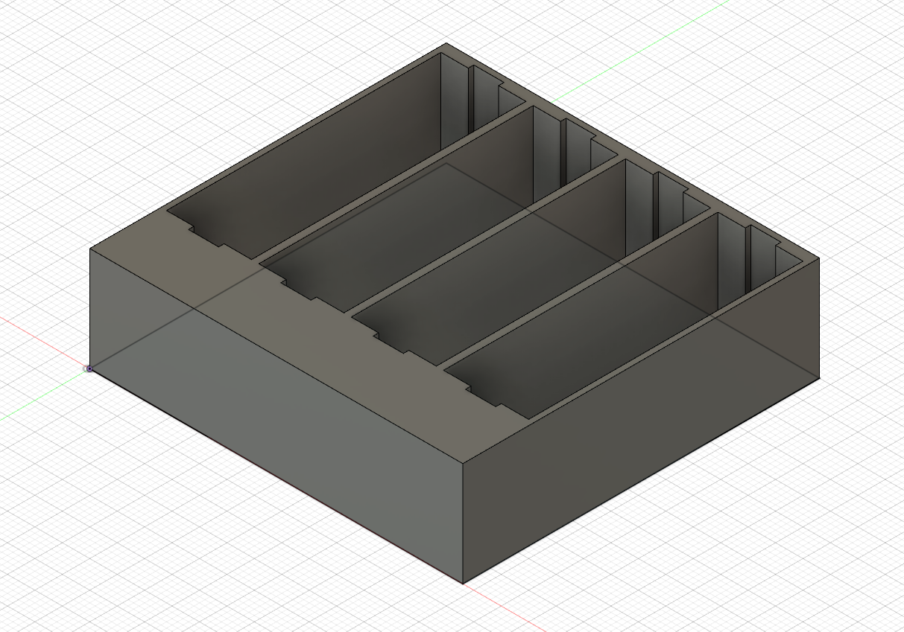
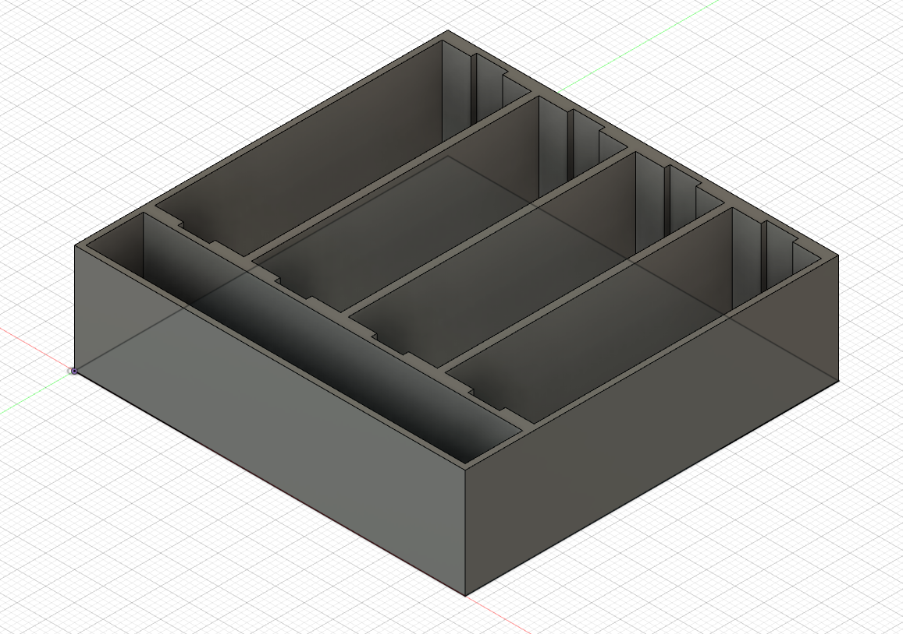
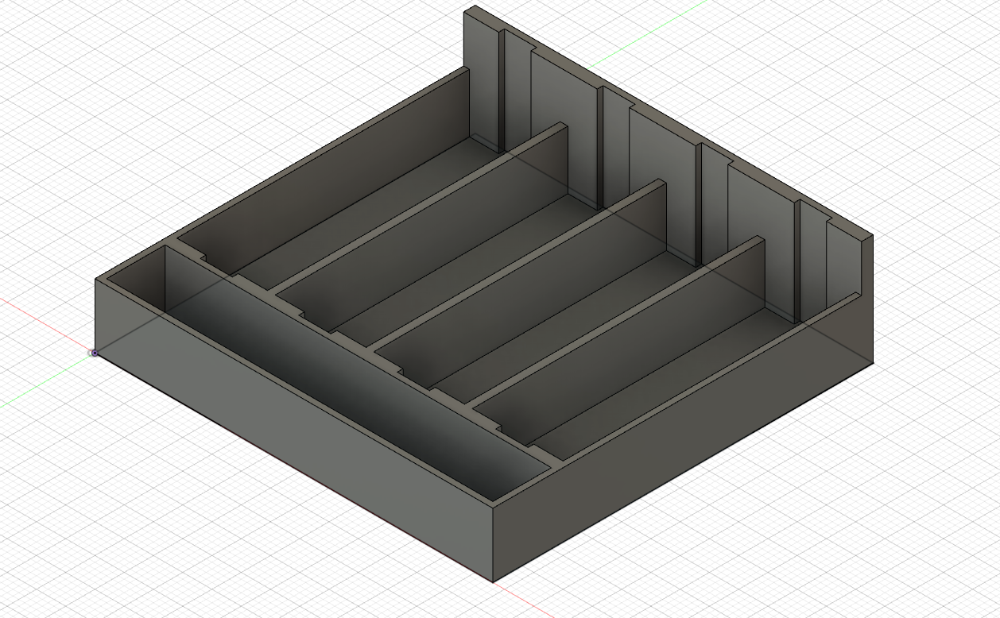
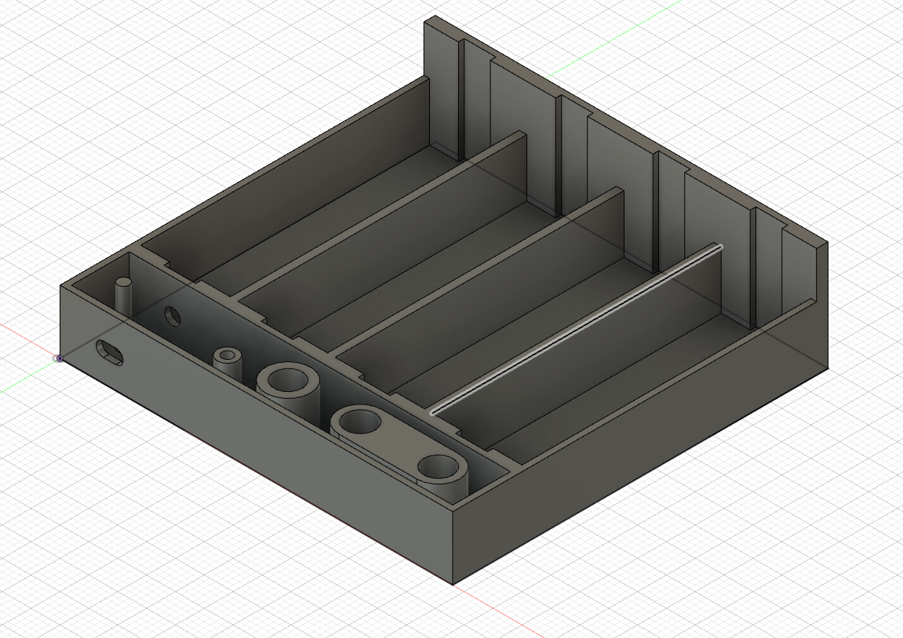
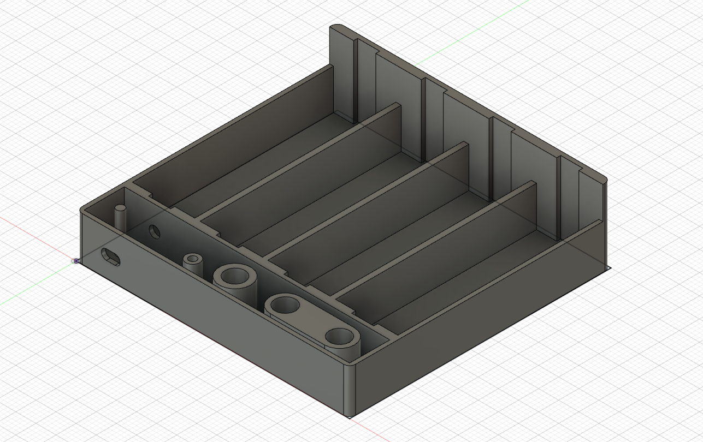

# MA1: Battery Holder

*Author. Emil Bartholdy (emba) - Date. 02-03-2021*

In this assignment I rougly build the 4AA 6V battery holder. Here is a link to the final product. https.//a360.co/3uJ9pQ1

For reference I include the schematics here.

## Steps to reproduce the battery Holder

1. Create the basic shape of the battery holder using the `sketch rectangle` tool and shape extrusion.
2. Using various rectangle sketches create a battery shape which should be slightly larger than an AA battery. Use reverse extrusion to create a battery shaped inset.
3. Using the `Rectangular Pattern` replicate the feature (i.e. the battery shaped inset) four times.
4. Create another inset for the various components at the bottom of the battery holder.
5. Using a new rectangular shape, select most of the battery holder except its top part. Then do reverse extrusion. This will make space for a lid for the battery holder.
6. Create various components for the bottom part of the battery holder including slots for wires.
7. Finally, fillet the edges of the battery holder.

## Steps in images

