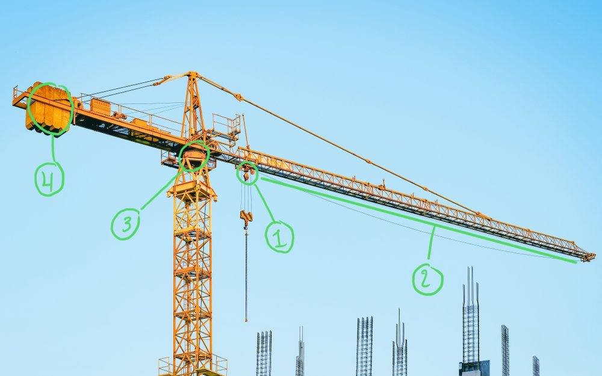
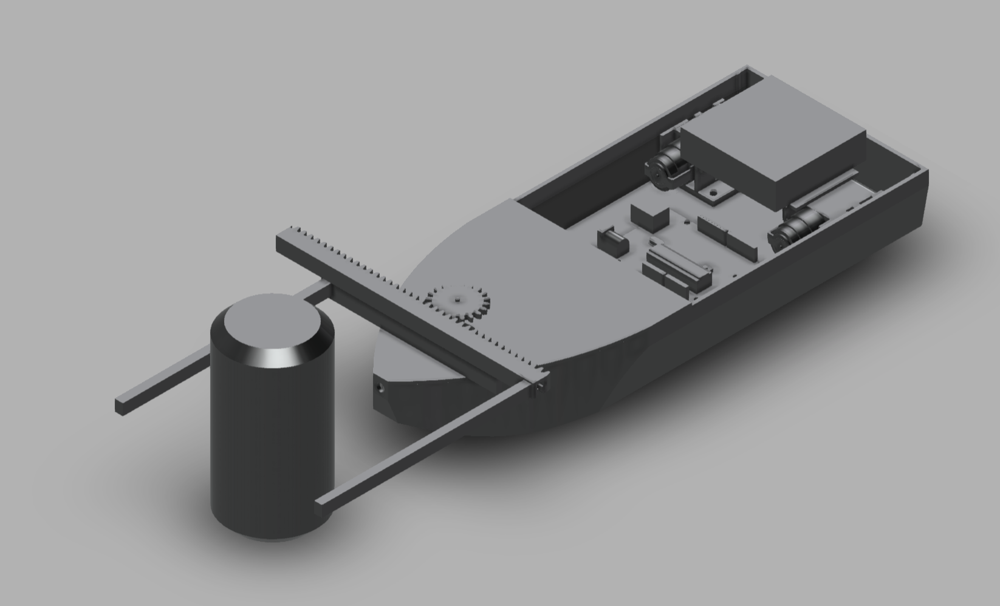
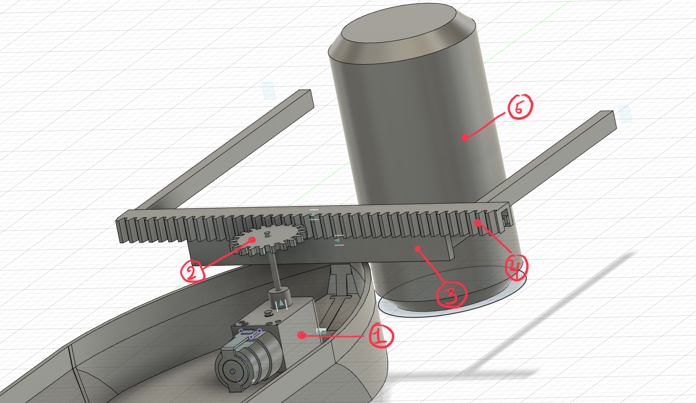

# MA4: Design a mechanism and describing a machine's mechanisms
*Emil Joakim Jensen Bartholdy (emba),​​ Alexander Oliver (alol) & Alma Rosager Freiesleben (alfr)*
*Date: 02-03-2021*

## Description of a machines mechanisms
*Choose a picture of a machine where you can see its mechanisms (3D printer, robot, milling machine, etc.) and describe how it works and its main components (20-30 lines max.)*

The machine mechanism we will describe is that of a crane. We will only describe the lifting mechanism. The specific crane that we will describe can be seen below:

{width=70%}

The interesting parts of the crane can be seen labelled in the picture. A crane is a structure that allows 4 degrees of freedom so that it can move in the three dimensional space.

The crane consist of a long working arm (called a 'jig') (see label 2) that is counter balanced by a heavy weight (label 4). Overall it acts a a lever. On the working arm hanging down is a device (label 1) that is connected via the 'rail' of the head. It has motors that can move the platform along the jig of the crane back and forth resulting (i.e. 1 degree of freedom), possibly connected by 2 infinite gears. On this platform hangs the hook itself that is used to grap objects from the ground and lift them up (or vice versa). This happens via a pulley that acts on rope. The length of the robe is controlled by a motor on to of the crane. Finally, there is a gear and motor used to rotate the crane itself (label 3).

## Designing a mechanism in Fusion 360
*NOTE: Unfortunately we did not notice in the assignment description that we were required to use a servomotor. We talked about our idea to a TA and he approved our solution, however we do not know if he is aware of this requirement.*

The gripper mechanism design can be seen at the following link: https://a360.co/3sGJqXz. It is also seen in figure [2](#fig1)

{#fig1}

To see an animation of the gripper mechanism, please click the following [link](https://www.icloud.com/iclouddrive/0m6KmnMihlOTTLbY8N-POyBLw#gripper).

---

The way the mechanism works can described in five overall steps (see the labelled image below).

{#fig2}

1. A motor creates rotary movement.
2. A gear on a stick is attached to the motor, utilising the rotary movement by the motor. The gear is connected to the infinity gear (label 4).
3. Welded to the boat is a piece of plastic that keeps the infinity gear in place working as a fixed bearing. This allows 1 degree of freedom.
4. The infinity gear then moves with the gear in (label 2) making the arms connect the can.
5. Finally the can is grapped by the arms.

In the future we would like to redesign the mechanism so that it can also lift the can and not only grasp it. 
