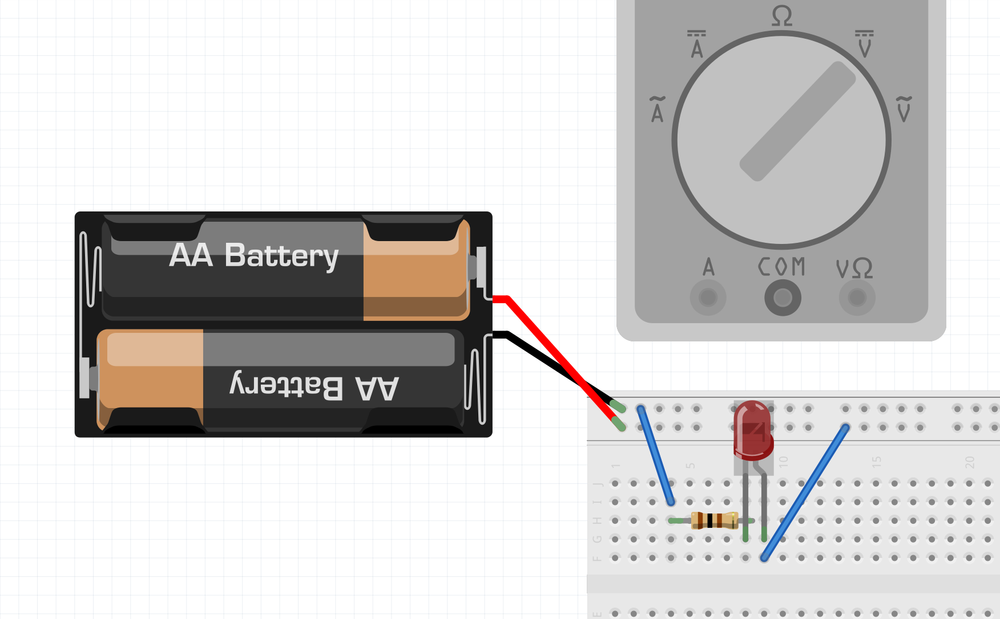

1. How does a multimeter measure drop in resistance (slide 050-18)
2. Why does red led not light up with circuit current of 30mA?

3. In circuit #4: why does it draw more current when the IR sensor does not detect anything, and less when it does?

