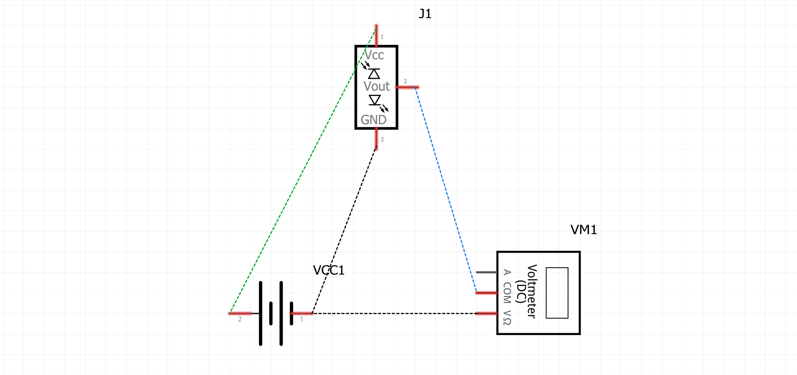

# MA5: Control a robot (sensors + motor + transistors)
*Emil Joakim Jensen Bartholdy (emba),​​ Alexander Oliver (alol) & Alma Rosager Freiesleben (alfr)*
*Date: 10-03-2021*

# Basic Sensor Circuits
- *Control LED intensity with a potentiometer*

This is our BB:

{width=50%}

This is or SCH:

{width=50%}

- *Read a potentiometer*

This is our BB:

{width=50%}

This is or SCH:

{width=50%}

- *Read the status of a switch with a multimeter*

This is our BB:

{width=50%}

This is or SCH:

{width=50%}

# Robot Controlling Circuits
- *A circuit to test a digital IR sensor FC-51*

This is our BB:

{width=50%}

This is or SCH:

{width=50%}

- *A circuit to test an analogue IR sensor*

This is our BB:

{width=50%}

This is or SCH:

{width=50%}

- *An H-bridge with switches and control a motor*

This is our BB:

{width=50%}

This is or SCH:

{width=50%}

## Questions and misunderstandings
We had a hard time with Fritzing, mostly with applying OHMs law and calculate the different parameters of the formula.

1. How does a multimeter measure drop in resistance (slide 050-18)?
2. Why does red led not light up with circuit current of 30mA?

{width=50%}

3. In circuit #4: why does it draw more current when the IR sensor does not detect anything, and less when it does?

{width=50%}

{width=50%}
---

