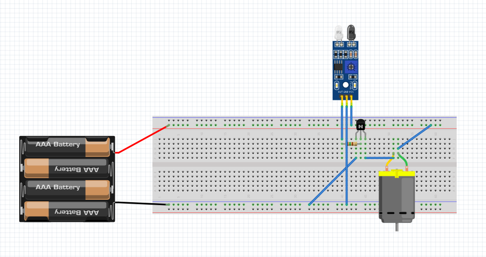
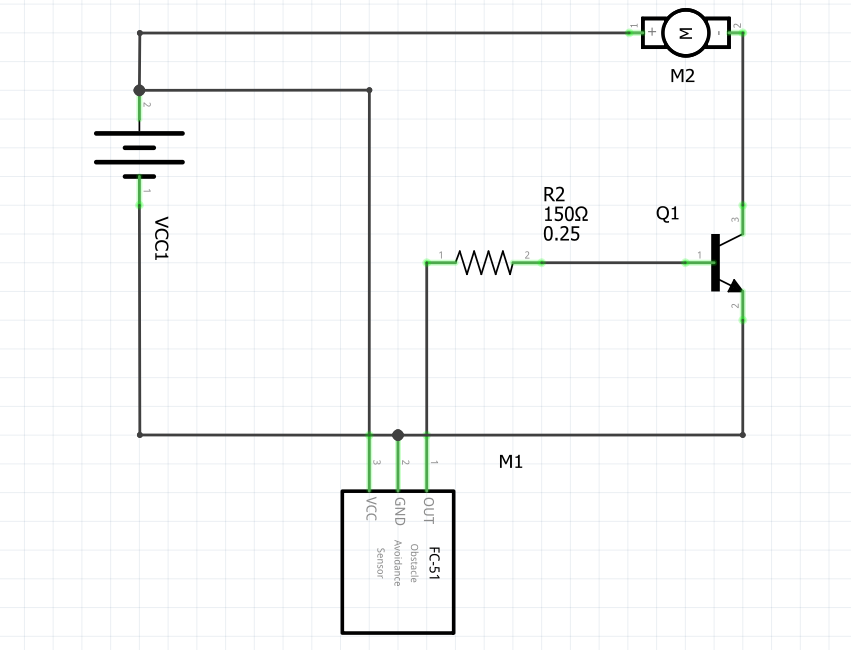
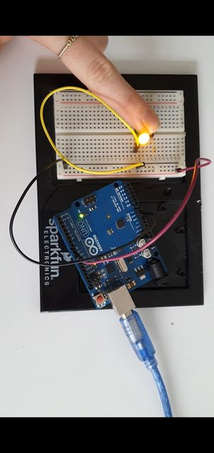
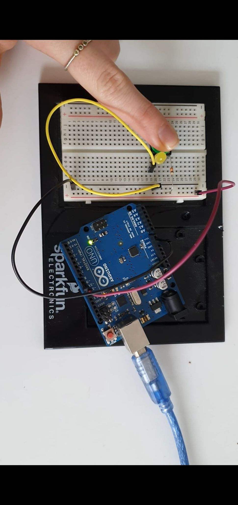
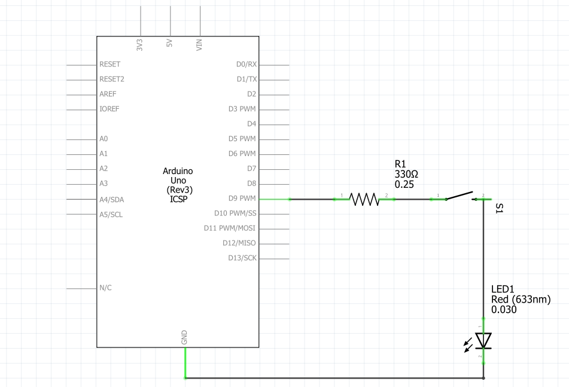
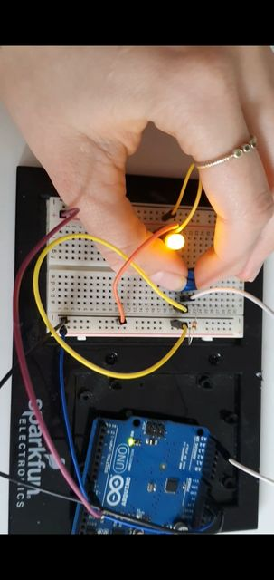
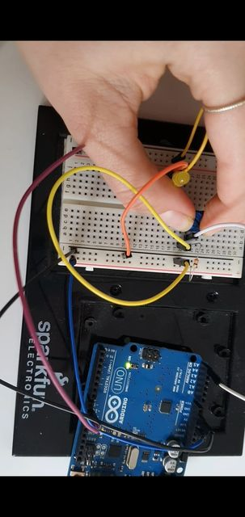
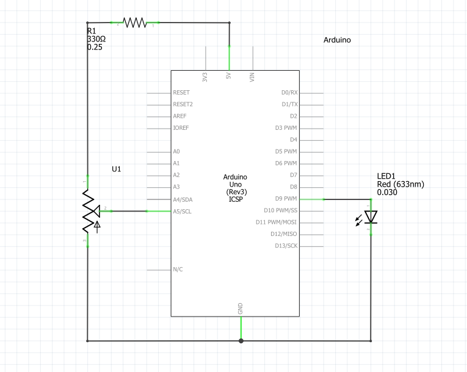
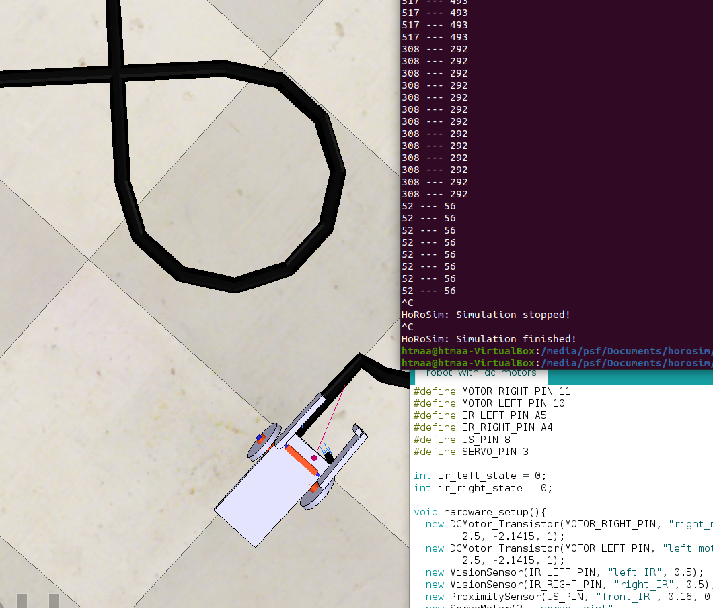

---
title: Creating a Line Following Robot - Programming With a Microcontroller
author: 
- Emil Joakim Jensen Bartholdy (emba)
- Alma Rosager Freiesleben (alfr)
date: 20-03-2021
header-includes: \usepackage{solarized-light}
...

# Part I: 

## Exercise 1
*Control a motor with an IR sensor (FC-51)*

### The BB circuit
{width=50%}

### The SCH circuit
{width=50%}

## Exercise 3
*Make a circuit with 1 button and one led*

### The real hardware circuit
{width=50%}
{width=50%}

### The SCH circuit
{width=50%}

### The Arduino code

```cpp
int LED = 9;

void setup() {
  pinMode(LED, OUTPUT);
}

void loop() {
  digitalWrite(LED, HIGH);
  delay(1000);
  digitalWrite(LED, LOW);
  delay(1000);
}
```

## Exercise 4
*Make a circuit with 1 potentiometer and one led* 

### The real hardware circuit
{width=50%}
{width=50%}

### The SCH circuit
{width=50%}

### The Arduino code

```cpp
int LED = 9;
int POT = A5;
int brightness = 0;

void setup() {
  pinMode(LED, OUTPUT);
  pinMode(POT, INPUT);
  //Serial.begin(9600); 
}

void loop() {
  delay(200);
  brightness = map(analogRead(POT),0,1023,0,255);
  //Serial.println(brightness);
  analogWrite(LED, brightness);
}
```

# Part II:

## Basic Description of Line Following Robot

Our line following robot uses the default model provided by Andrés. Since we are only two group members, our line following robot is not designed to grap an object at the end of the track. The line following robot consists of the following electronic components:
1. Two DC motors (for either side of the robot)
2. Two IR sensors (for either side of the robot)
3. An Arduino Uno microcontroller

We have implemented the line following robot with HoRoSim and CoppeliaSim.

The line following robot uses the algorithm:

1. If both IR sensors detect the same color, both motors should turn.
2. If the right IR sensor detects black (0) then then only the left motor should turn.
3. If the left IR sensor detects black (0) then then only the right motor should turn.

The code for this can be seen below:

```cpp
#define MOTOR_RIGHT_PIN 11
#define MOTOR_LEFT_PIN 10
#define IR_LEFT_PIN 13
#define IR_RIGHT_PIN 12
#define US_PIN 8
#define SERVO_PIN 3

int ir_left_state = 0;
int ir_right_state = 0;

void hardware_setup(){
  new DCMotor_Transistor(MOTOR_RIGHT_PIN, "right_motor", 
        2.5, -2.1415, 1);
  new DCMotor_Transistor(MOTOR_LEFT_PIN, "left_motor", 
        2.5, -2.1415, 1);
  new VisionSensor(IR_LEFT_PIN, "left_IR", 0.5);
  new VisionSensor(IR_RIGHT_PIN, "right_IR", 0.5);
}

void setup() {
  // put your setup code here, to run once:
  pinMode(MOTOR_RIGHT_PIN, OUTPUT);
  pinMode(MOTOR_LEFT_PIN, OUTPUT);

  Serial.begin(9600);
}

void loop() {
  ir_right_state = digitalRead(IR_RIGHT_PIN);
  ir_left_state = digitalRead(IR_LEFT_PIN);
  
  /*if(ir_left_state != ir_right_state) {
    Serial.print(ir_left_state);
    Serial.print(" --- ");
    Serial.println(ir_right_state);
  }*/

  if (ir_right_state == ir_left_state)
  {
    digitalWrite(MOTOR_RIGHT_PIN, HIGH);
    digitalWrite(MOTOR_LEFT_PIN, HIGH);
  }
  else if (ir_right_state == 0)
  {
    digitalWrite(MOTOR_RIGHT_PIN, LOW);
    digitalWrite(MOTOR_LEFT_PIN, HIGH);
  }
  else if (ir_left_state == 0)
  {
    digitalWrite(MOTOR_RIGHT_PIN, HIGH);
    digitalWrite(MOTOR_LEFT_PIN, LOW);
  }

  delay(10);
}
```

We were unfortunately unsuccesful in having the line robot follow the line: we suspect that one of the sensors might not correctly sense color as can be shown in the following picture:

{width=50%}

As we can see from the above picture, even if the left sensor is on black and the right on white, they emit approximately the same values. We do not think this is an issue in the code (we have thoroughly inspected it), so please if you can give us feedback on what might be wrong.