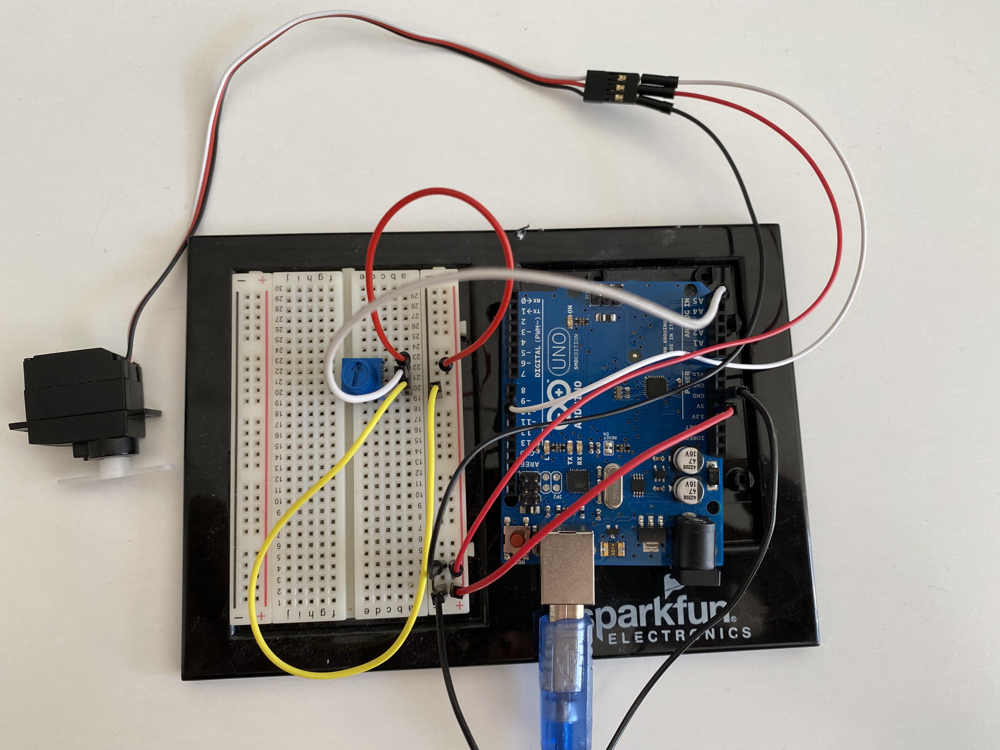
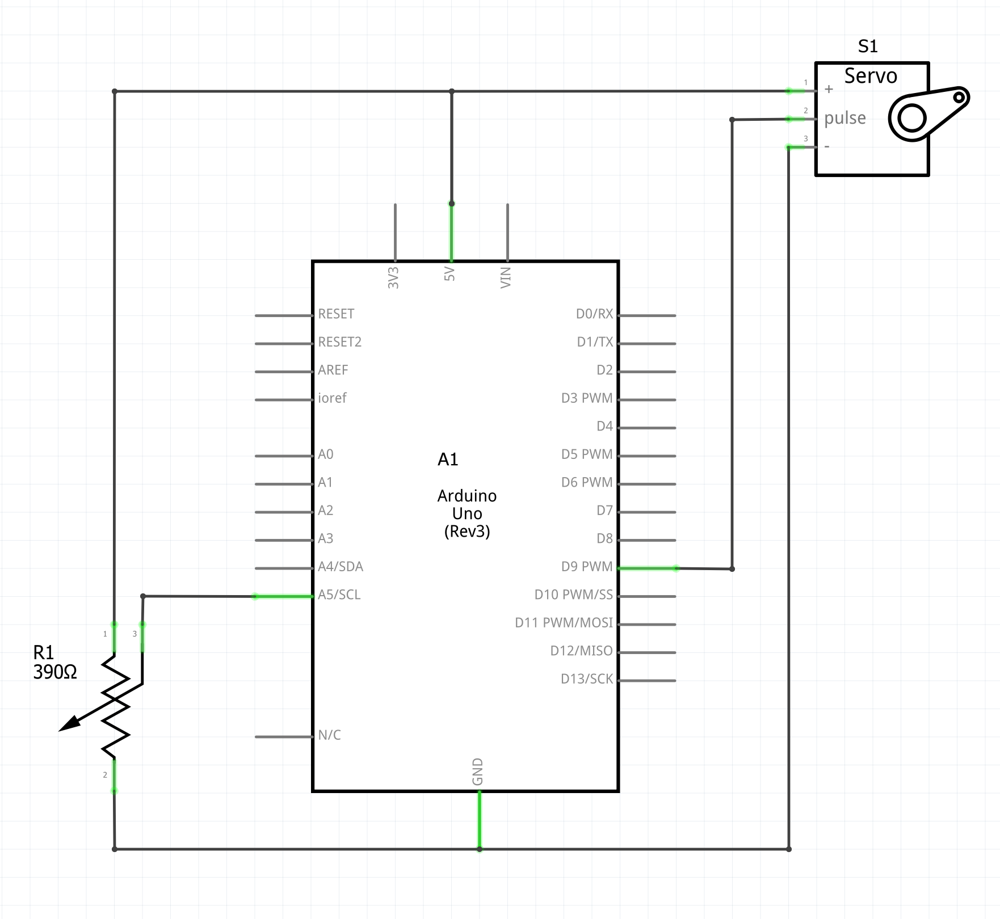
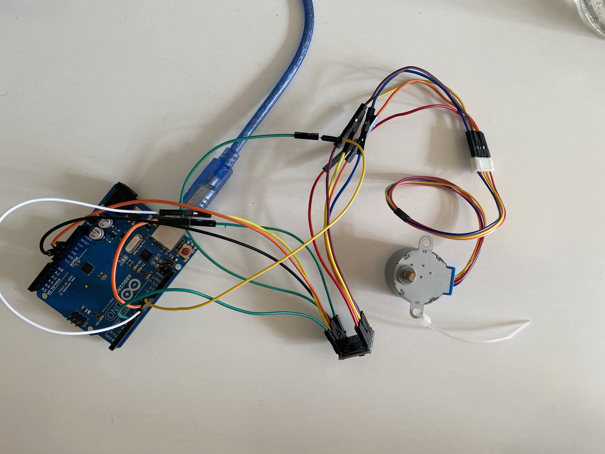
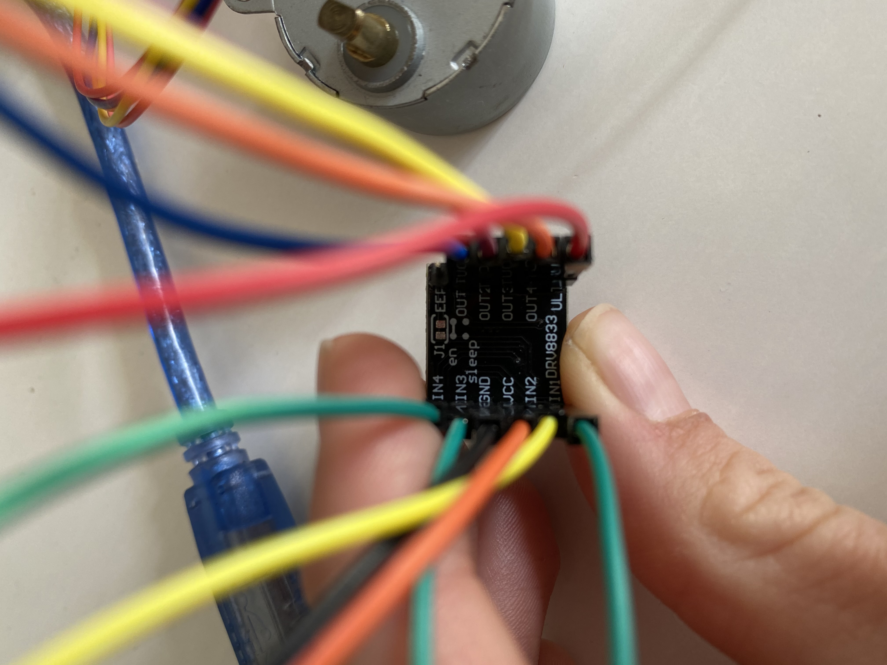
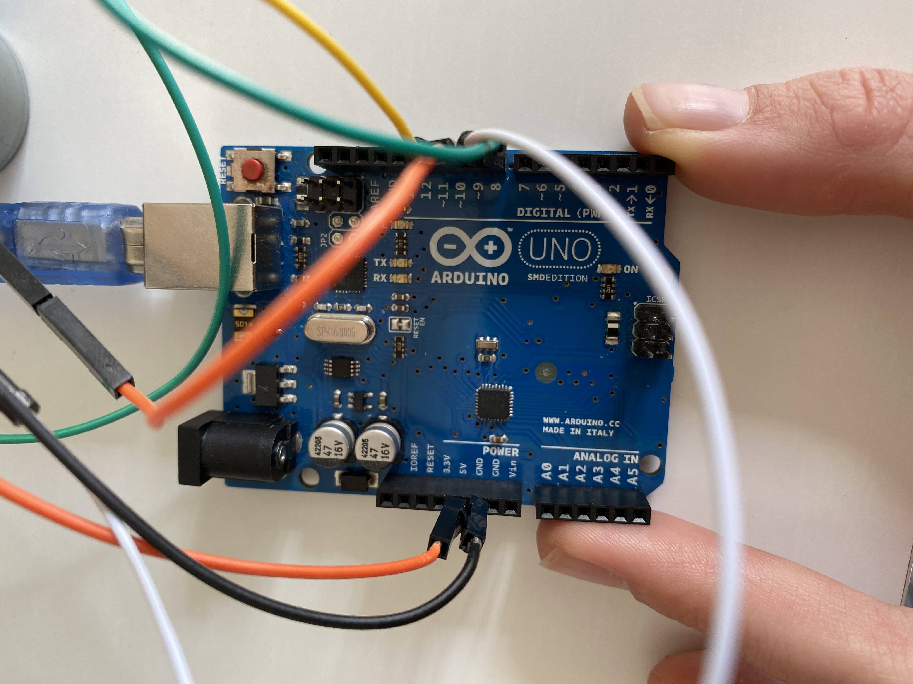
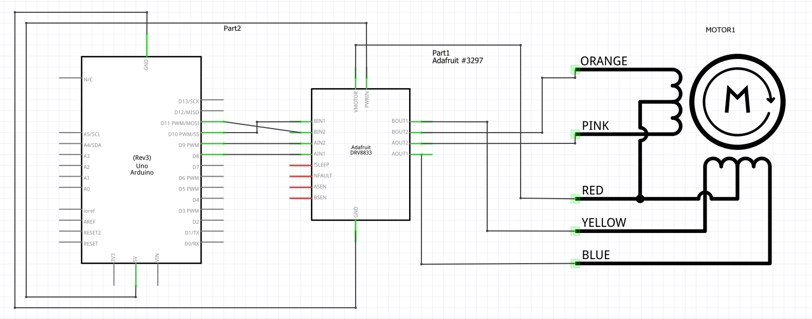

---
title: Advanced electronics – Sensor and actuators
author: 
- Emil Joakim Jensen Bartholdy (emba)
- Alma Rosager Freiesleben (alfr)
date: 26-04-2021
header-includes: \usepackage{solarized-light}
...

**NOTE**: For this assignment we chose to only implement the advanced sensor and actuators part of the assignment.

# Circuit with potentiometer and servo
- *a circuit where the position of the servo is controlled by an Arduino based on the readings from a potentiometer*

This is our BB:

{width=50%}

This is or SCH:

{width=50%}

This is our code:
```cpp
#include <Arduino.h>
#include <Servo.h>

int SERVO_PIN = 9;
int POT = A5;
int angle = 0;
int readValue = 0;
Servo servo;

void setup() {
  pinMode(POT, INPUT);
  servo.attach(SERVO_PIN);
}

void loop() {
  readValue = analogRead(POT);
  angle = map(readValue, 0, 1023, 0, 180);
  servo.write(angle);
  delay(100);
}
```

Lastly you can watch a movie of this circuit, following this [link](https://www.icloud.com/iclouddrive/04bnzdqWWIENl6SqaIPtGvLFQ#e1)

# Circuit with stepper motor
- *a circuit where you move a stepper motor with an Arduino.*

No stepper motor or motor driver was included in Arduino kits we received, however we were already in possession of two such elements.
Stepper motor model: 28BYJ-48
Motor driver: DRV8833

This is our BB:

{width=50%}
{width=50%}
{width=50%}

This is or SCH:

{width=50%}

The code is from this [link](https://www.seeedstudio.com/blog/2019/03/04/driving-a-28byj-48-stepper-motor-with-a-uln2003-driver-board-and-arduino/).

This is our code:
```cpp

#include <Stepper.h>

#define STEPS 2038 // the number of steps in one revolution of your motor (28BYJ-48)

Stepper stepper(STEPS, 8, 10, 9, 11);

void setup() {
  Serial.begin(9600);
}

void loop() {
  stepper.setSpeed(1); // 1 rpm
  stepper.step(2038); // do 2038 steps -- corresponds to one revolution in one minute
  delay(1000); // wait for one second
  stepper.setSpeed(6); // 6 rpm

  // do 2038 steps in the other direction with faster speed
  // corresponds to one revolution in 10 seconds
  stepper.step(-2038); 
}
```

We did not succeed in actually getting the motor to spin, we suspect that it is because we did not have batteries to test with, but only the 5V from the arduino. We are using stepper motors in our exam project, so we will test it in the comming week.
