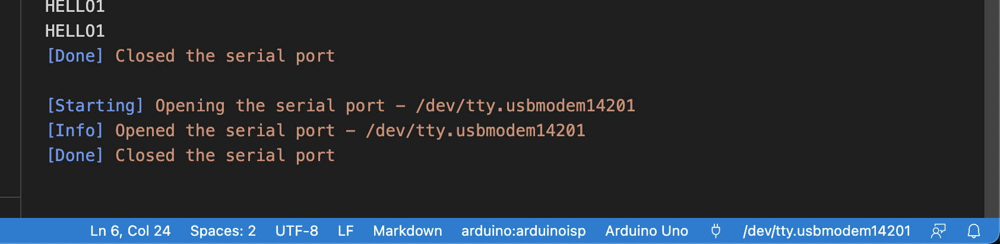

# Welcome to Alma and Emil's HTMAA repo!

## Notes

### View output from arduino in vscode
You can view output from arduino in vscode by pressing the little "plug" icon. You can also choose the "port" to listen for (e.g. "9600" is a common choice for printing stuff).

