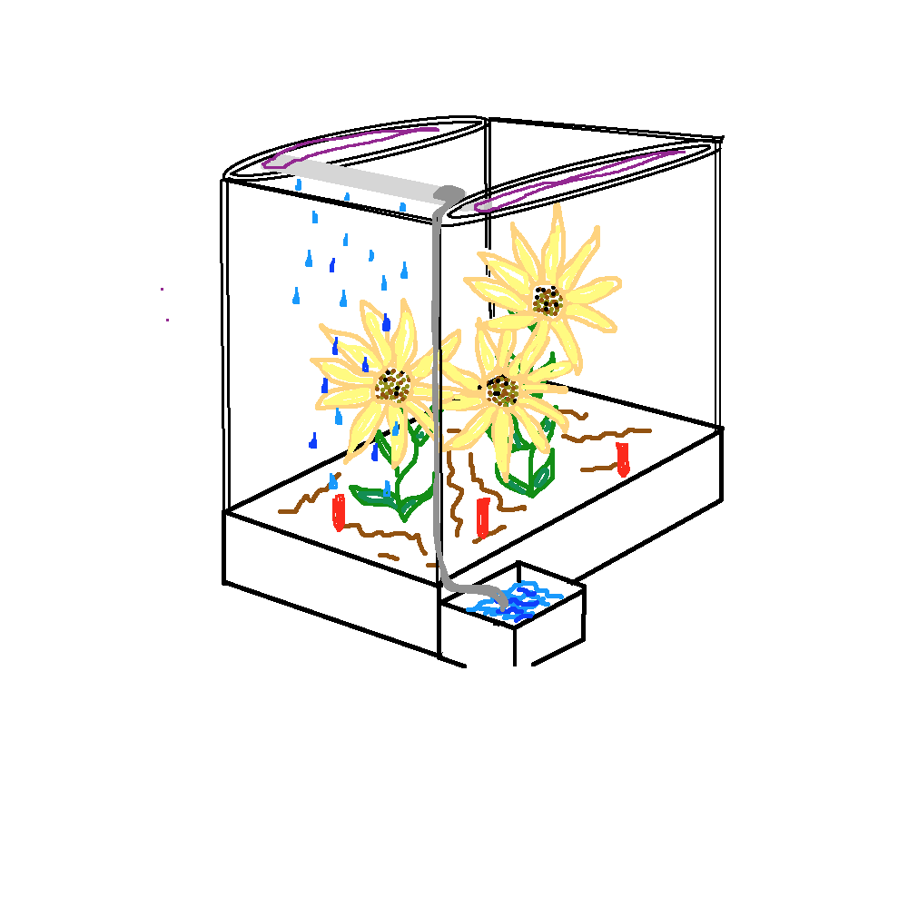
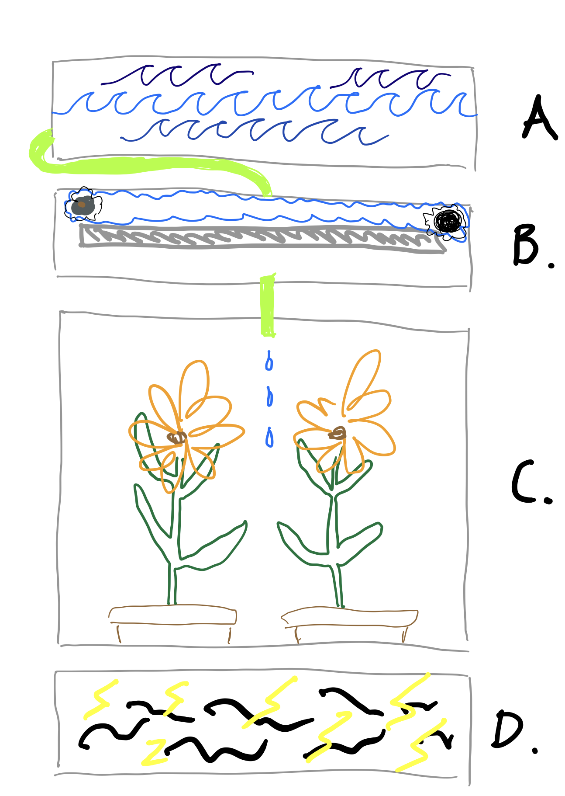
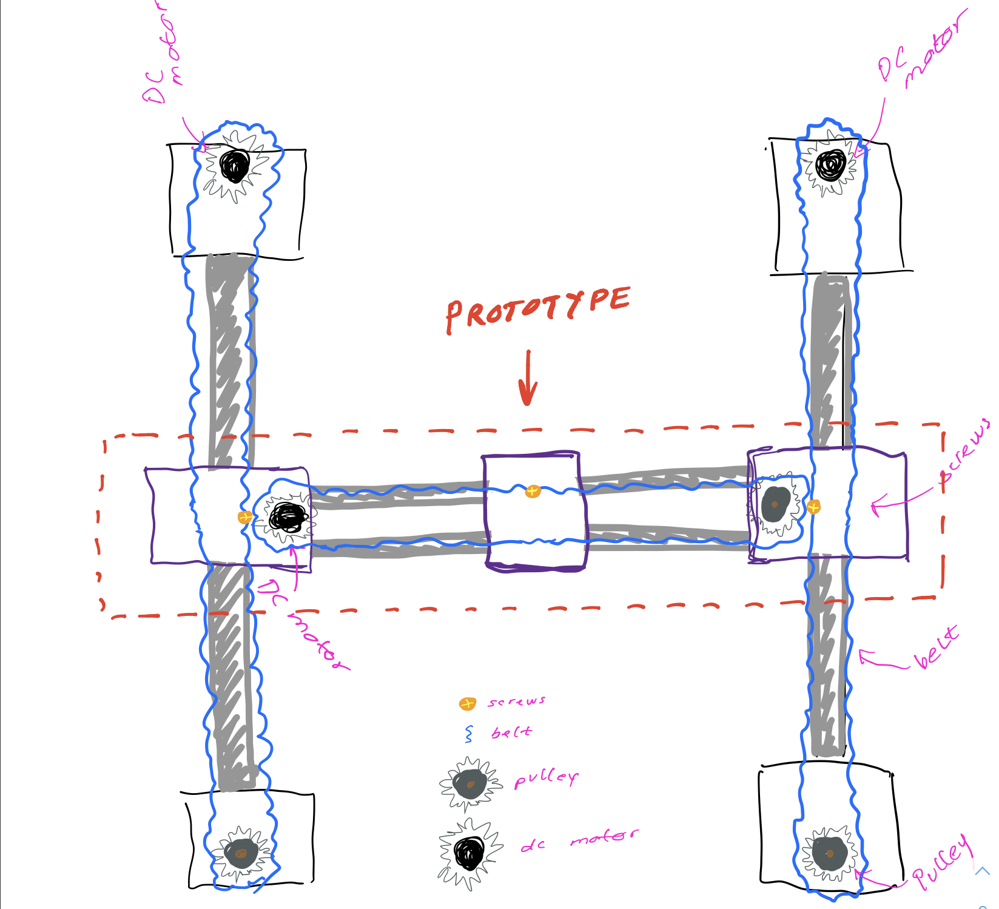

# Self-watering plant box

{width=50%}

## The idea
We have decided to design a system that can water plants in pots. This decision has been made based on the wish to work with motors and a moving the water around from the top of the glass cage. 

## Moving the hose
We want to have a hose moving around in two planes, inspired by how a 3D printer moves. 

Ideas for how to move the hose:
- These axis should be moved according to a signal from a sensor attached to the hose and then having a base with a crazy color, the color of the plant/pot and then start to apply water.
- Having some wort of pressure measuring mechanism in the buttom of the cage, that can send the coordinates of the pot and based on those the hose would move. 

### Parts
* Color sensor: TCS3200 RGB COLOR SENSOR
* Motors: 3 DC motors
* Water pump: Maybe not needed some sort of water blocking mechanism, since the water is place on top of the box.
* Moist sensor: Jord-hygrometer modul til Arduino

### Example mechanism
https://www.researchgate.net/figure/3D-printer-mechanism_fig2_323395870
https://arthurguy.co.uk/blog/2014/2/laser-engraver-cutter-build-log-part-1

## The water tank and hose

## Possible extensions
* Plant lights
* Control of air moisture
* Addition of fertilizer
---

# Introduction  
What is the motivation to build your device? Why is this important (at least to you)?

* Both of us are interested in horticulture.
* Watering plants correctly can be a challenge: Both over and under watering the plants will kill them.
* We wish to 

# Background 
Has this been done before? How? If not, what's the closest related device/prototype? Is there any novelty in your device? (It is not necessary that your device is novel) Did you use an existing project as inspiration or starting point?

* Self-watering planters have been done. Mostly without electronics:
* The novelty in the device will be that the box is not filled with dirt (this can be difficult to remove / clean). Instead the user will be able to freely place pots in the device.

# Requirements
What are the requirements or specifications? What are the capabilities that your device should have?

* The device can detect pots.
* When pots are dry they device will water the appropriate dry pot. (Different plants / sized pots dry differently)

Extensions to the requirements (if time allows):
* The devices gives the plants an appropriate amount of light within some time box.
* The controls the moisture in the air for the plants.

# Description - Your device

How does your device work? Describe in as much detail as you can fit into the report. It should contain three subsections: Mechanics, Electronics and Software/Firmware. Describe also what alternatives you analyzed for the different parts of your device. Why did you select the alternative that you finally used?

An overview of the entire device can be seen in the sketch below:


(It can be seen described bleow)

A. A water tank that contains water for the plants
B. The watering mechanism inspired from a 3d-printer.
C. The plants in pots.
D. The bottom layer containing the electronics.

## Part B:
This part will be the most complicated one. It is briefly described below:


* The 3d-printer inspired mechanism can move a platform along the x and y axis (see figure above)
* This platform includes a color sensor that is used to detect whether the platform is above a pot or not. It also includes a small water hose that can provide water from an above tank down to the pot (Part A).
* The part we will make a prototype of is the dashed area of the figure above.

## Part C:
* The pots contains moisture sensors that provide info on how dry the soil is. Based on this, part B will be controlled.

# Results/Analysis
Did it work properly? What kind of tests did you run to test your prototype? Could you provide some data that shows the performance of the prototype (speed, success rate, etc.)?

# Discussion
What are the strengths and shortcomings of your device? Did it match the requirements?  How would you improve/develop it further, if you had time? If you had to produce your device in a factory for mass production, what would you modify? 

# References (Optional):
You can add references, but they are not needed. (All the parts used in your project should be documented in the annexes.)

# Annexes (mandatory) (there is no limit of pages and it is not necessary to use the template for this section):

# Questions
* Will we be able to build this project physically?
  * We will be able to 3d print stuff in the future.
* Are we supposed to create a report of the project? What should that report contain?
  * Yes...
* Feedback on project: Ask Andres.


Compiling the report
```
pandoc -H disable_float.tex --toc -s -V geometry:margin=0.75in -o report.pdf report.md
```